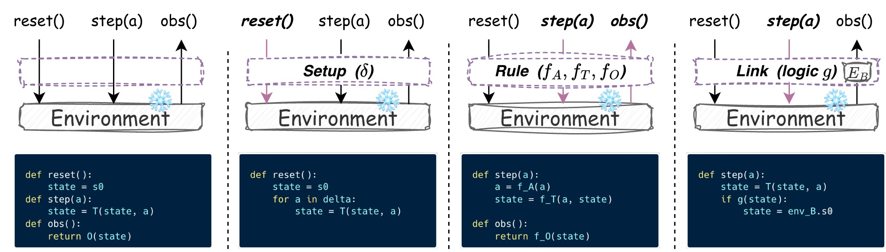

# *EnvHarness*: Awakening Static Worlds for Agent Learning

Check out our [paper](https://arxiv.org/abs/2608.19880) and [webpage](https://envharness.com/) for more details.

## 🔥 Updates

<!-- FILL: one dated bullet per release / acceptance / follow-up, newest first. -->
- [2026-08-21] We released our [paper](https://arxiv.org/abs/2608.19880) and [website](https://envharness.com/).

## 🏴󠁶󠁵󠁭󠁡󠁰󠁿 Overview

As LLMs become autonomous agents, they learn less from curated text and more from
interactive environments. But those environments are expensive to build and, once
built, stay **static** — they behave identically no matter which agent interacts
with them or how much it has improved, so they can neither target a particular
agent's weaknesses nor keep teaching once its tasks are solved. **EnvHarness**
applies the *agent harness* idea to the other side of the interaction: just as an
agent harness makes a frozen LLM capable through plug-in components (skills,
memory, tools) without changing its weights, EnvHarness wraps a **frozen
environment** with its own plug-in components to make it dynamically controllable
— without touching the environment's internal code.

The layer is assembled from three plug-in components — **Setup** (reshape the
initial state), **Rule** (reshape the interaction: which actions are allowed,
what they do, and what the agent observes), and **Link** (compose in another
environment's tasks) — that operate strictly at the standard `reset` / `step`
interface and stack freely. They reshape only *what the agent observes, what it
may do, and where it starts*; the goal predicate that decides success is left
untouched, so every reshaped environment keeps the original benchmark's trusted,
human-built verifiers — and because nothing reaches into environment-specific
code, the same system works across domains.

<p align="center">
  
</p>

<p align="center"><em>The three EnvHarness components against the environment interface.</em> The leftmost panel is a bare environment; each of the others plugs in one component — <strong>Setup</strong> (reshapes the initial state), <strong>Rule</strong> (reshapes the interaction: which actions are allowed, what they do, and what the agent observes), and <strong>Link</strong> (composes another environment's tasks in) — and highlights the interface calls it intercepts. All panels expose the same contract and leave the underlying implementation, tasks, and verifiers untouched.</p>

An LLM **designer agent** drives a diagnostic loop: it reads the
agent's trajectories to diagnose a specific weakness, writes components that
reshape the environment to target it, tests the policy in the new environment,
and revises until the environment can actually *teach* what the agent lacks. The
signal is targeted (written against diagnosed flaws) and lasting (the loop repeats
as the agent improves, co-evolving the two).

Across ALFWorld, WebArena, SWE-bench Verified, OfficeQA, and SpreadsheetBench,
skills learned in EnvHarness environments beat both the no-skill baseline and
skills learned in the original environments — more effective (up to +9 points on
held-out tasks) and more efficient (~9.8% fewer interaction steps). The same
dynamic environments also produce stronger policies under reinforcement learning,
and repeating the designer loop compounds the gains round after round.

### Key Features
* **Frozen environments, no internal edits:** the benchmark's task set, its
  dynamics and its grading stay exactly as published. Only the layer the agent
  acts *through* changes.
* **Code as the Envharness:** the designer emits real Python — a `_Rules(Rules)`
  subclass — not a selection from a fixed menu. It is compiled and executed in
  an isolated subprocess, so a bad mutation becomes a recorded trace instead of
  a dead run.
* **Composable by construction:** an `EnvHarness` *is* an `ActionableEnv` that
  wraps another one, so layers stack arbitrarily and every benchmark is driven
  through a single interface.
* **Benchmark-agnostic:** adding an environment means implementing one
  interface; the designer, the components, the loop and the evaluation stages
  need no changes.

---

## ⚡️ Quickstart Guide

### 0. LLM Configuration

Every stage -- corpus generation, skill induction, evaluation -- takes the same
model string, so a provider is one line of config. Three families are
supported:

- **GPT**: to use OpenAI models (`gpt-4.1-mini`, `gpt-4.1`, `gpt-4o`, `o4-mini`),
  set your API key:
  ```bash
  export OPENAI_API_KEY="your-openai-api-key"
  ```

- **Claude**: to use Claude (`claude-sonnet-4-6`) on Vertex AI, set up
  Application Default Credentials (unnecessary on a GCE VM with an attached
  service account) and name your project:
  ```bash
  gcloud auth application-default login
  export GOOGLE_CLOUD_PROJECT="your-project-id"
  pip install "google-cloud-aiplatform>=1.38"
  ```

- **Gemini**: to use Gemini models (`gemini-3.5-flash`, `gemini-3.1-flash-lite`)
  through the Gemini API, set your key:
  ```bash
  export GEMINI_API_KEY="your-gemini-api-key"
  ```

Name the model wherever a config takes one -- the provider prefix selects the
backend, and `envharness.infra.model` supplies that provider's auth and
parameter handling:

```yaml
policy:
  model: openai/gpt-4.1-mini          # or gemini/... or vertex_ai/claude-...
mutator:
  type: llm
  model: vertex_ai/claude-sonnet-4-6  # the two roles can differ
```

A driver's `MODEL` env var accepts the same strings and applies to **every**
stage of that run -- corpus policy, harness agent, skill induction and
evaluation -- overriding whatever the YAML names, so a run never ends up
split across providers:

```bash
MODEL=openai/gpt-4.1 python experiments/swebench/reproduce.py
```

The same override is available directly on the Stage 1 runner:

```bash
python scripts/run_harness.py --config <corpus.yaml> --model openai/gpt-4.1-mini
```

Leave `MODEL` unset to keep the per-role models the config names -- which is
how you give the policy and the harness agent different models.

**Concurrency follows your rate limit, not your CPU.** Every benchmark runs
its tasks through a pool of workers (`CORPUS_WORKERS`, `EVAL_WORKERS`,
`EVAL_CONCURRENCY`, ... -- see each benchmark's README). The defaults suit a
modest quota; a pool large enough to saturate your provider's tokens-per-minute
tier turns into 429s that truncate episodes mid-task, which shows up as
unexpectedly low success rates rather than as an error. Raise the pool when
your quota allows, and on Gemini give it several keys (`GEMINI_API_KEYS`) --
that quota is metered per key, so the workers spread across them.

#### Embeddings

Skill retrieval needs an embedding model too. You do not normally pick one:
each provider is paired with an embedding model the *same* credentials already
reach, so setting `MODEL` is enough.

| `MODEL` provider | embedding model | dim |
| --- | --- | --- |
| `openai/...` | `openai/text-embedding-3-small` | 1536 |
| `vertex_ai/...` | `vertex_ai/text-embedding-004` (same ADC) | 768 |
| `gemini/...` | `gemini/gemini-embedding-001` | 3072 |

`EH_EMBED_MODEL` overrides the pairing for both bank building and retrieval,
and takes any embedding model litellm supports (with that provider's own
credentials set):

```bash
EH_EMBED_MODEL=openai/text-embedding-3-small \
MODEL=vertex_ai/claude-sonnet-4-6 python experiments/alfworld/reproduce.py
```

That is also why the override exists: it holds one embedding space fixed while
the policy provider changes. A bank stores its vectors, and `Bank.retrieve`
rejects a query vector of a different width, so changing the embedding model —
including by changing provider — means rebuilding the bank.

### 1. Run a benchmark

Each benchmark has its own environment and its own one-command driver.
**Open the README in the experiment folder you want to run** — it carries the
environment setup, the run commands and the knobs for that benchmark:

- [`experiments/toy24`](experiments/toy24/README.md)
- [`experiments/alfworld`](experiments/alfworld/README.md)
- [`experiments/swebench`](experiments/swebench/README.md)
- [`experiments/webarena`](experiments/webarena/README.md)
- [`experiments/officeqa`](experiments/officeqa/README.md)
- [`experiments/spreadsheetbench`](experiments/spreadsheetbench/README.md)

Every folder follows the same shape:

```bash
python scripts/check_env.py <benchmark>           # preflight
bash experiments/<benchmark>/reproduce_smoke.sh   # the same stages, fewer tasks
python experiments/<benchmark>/reproduce.py       # the full protocol
```

The experiments above distill/evaluate **skills**. For **RL training** — a policy
trained with GRPO directly inside EnvHarness environments (via verl-agent) — see
[`rl/`](rl/README.md).


## 📊 Results

Skills induced from EnvHarness-adapted environments transfer back to the
**untouched** benchmark and beat both controls — no skills at all, and skills
induced from the original environments. All numbers are the mean over three
independent runs, with standard deviations as subscripts. A dash marks a
baseline that is benchmark-specific and cannot be applied to the other domain;
EnvHarness covers every benchmark through the same interface.

### ALFWorld and WebArena

| Skill Source | ALFWorld In-Dist | ALFWorld OOD | ALFWorld Avg. | Reddit | Shopping | Shop Admin | GitLab | WebArena Avg. |
|:---|:---:|:---:|:---:|:---:|:---:|:---:|:---:|:---:|
| No Skills | 62.6<sub>1.7</sub> | 60.7<sub>5.2</sub> | 61.7<sub>3.4</sub> | 39.6<sub>2.3</sub> | 35.2<sub>3.3</sub> | 44.1<sub>2.3</sub> | 35.8<sub>8.4</sub> | 38.7<sub>2.3</sub> |
| Original Envs | 63.3<sub>2.8</sub> | 61.4<sub>4.3</sub> | 62.4<sub>3.4</sub> | 38.7<sub>9.7</sub> | 35.2<sub>1.3</sub> | 44.6<sub>3.0</sub> | 35.4<sub>4.0</sub> | 38.5<sub>3.1</sub> |
| GenEnv | 63.3<sub>1.2</sub> | 61.9<sub>2.7</sub> | 62.6<sub>1.9</sub> | — | — | — | — | — |
| VeriEnv | — | — | — | 39.6<sub>4.2</sub> | 30.2<sub>0.0</sub> | 49.7<sub>2.4</sub> | **38.9**<sub>5.6</sub> | 39.6<sub>1.4</sub> |
| **EnvHarness Envs** | **66.2**<sub>0.3</sub> | **70.4**<sub>2.3</sub> | **68.3**<sub>1.3</sub> | **40.6**<sub>4.7</sub> | **37.4**<sub>0.3</sub> | **50.8**<sub>1.5</sub> | 37.7<sub>3.1</sub> | **41.6**<sub>1.8</sub> |
| *Δ (EnvHarness − Original)* | *+2.9* | *+9.0* | *+5.9* | *+1.9* | *+2.2* | *+6.2* | *+2.3* | *+3.1* |

### SWE-bench Verified, OfficeQA and SpreadsheetBench

| Skill Source | SWE-verified SR ↑ | SWE-verified AS ↓ | OfficeQA EM ↑ | OfficeQA F1 ↑ | SpreadsheetBench Pass@1 ↑ | SpreadsheetBench Mean Score ↑ |
|:---|:---:|:---:|:---:|:---:|:---:|:---:|
| No Skills | 47.67<sub>0.93</sub> | 53.58<sub>2.93</sub> | 54.23<sub>2.84</sub> | 55.77<sub>2.98</sub> | 46.44<sub>0.15</sub> | 61.32<sub>0.37</sub> |
| Original Envs | 49.88<sub>2.59</sub> | 55.01<sub>1.69</sub> | 54.40<sub>1.84</sub> | 55.77<sub>1.59</sub> | 45.88<sub>1.19</sub> | 61.47<sub>0.59</sub> |
| SWE-smith | 50.12<sub>1.74</sub> | 54.72<sub>2.03</sub> | — | — | — | — |
| **EnvHarness Envs** | **52.58**<sub>2.72</sub> | **49.61**<sub>2.49</sub> | **56.20**<sub>2.34</sub> | **57.73**<sub>2.29</sub> | **49.15**<sub>0.36</sub> | **62.48**<sub>0.27</sub> |
| *Δ (EnvHarness − Original)* | *+2.70* | *−5.40* | *+1.80* | *+1.97* | *+3.27* | *+1.01* |

SR = success rate, AS = agent steps (lower is better), EM = exact match.
The three skill sources correspond to the conditions each `reproduce.py` prints:
`nobank` (No Skills), `orig` (Original Envs) and `ours` (EnvHarness Envs).

**Models.** Every number in both tables was produced with **Gemini**. The
configs in this repo default to `openai/gpt-4.1-mini`, so reproducing the
tables means pointing them back at Gemini:

```bash
MODEL=gemini/gemini-3.5-flash python experiments/swebench/reproduce.py
```

`MODEL` reaches every stage, embeddings included -- those runs used Gemini's
own `gemini-embedding-001`, which is what this one switch selects, so nothing
else needs setting. Alternatively edit the one `model:` line in that
benchmark's `corpus.yaml` and `reasoning_bank_eval.yaml`. Absolute numbers move
with the model; what the tables compare is skill sources at a fixed model.

## 🧱 Adding a New Benchmark

A benchmark joins EnvHarness by implementing **one interface**, `ActionableEnv`
(`reset / step / observe / evaluate / get_env_state / save_state / from_state`).
Everything downstream — the Environment Designer, the three components, the loop,
the evaluation — is benchmark-agnostic and needs no changes.

### 1. Implement the Bridge

The Bridge is the **only** layer that may know about a docker container, a
browser session, or a simulator. Subclass `ActionableEnv`, register a stable
tag, and implement the seven required methods.

`tool_registry` declares the action space. Its schemas are what the Policy is
given to act with, and what the Environment Designer is shown so a Rule's
action hook can match on `action.name`. Each entry is a `Tool` whose schema is
introspected from its `invoke` signature — see any
`envharness/bridges/*/tools.py` for the shape.

```python
# envharness/bridges/mybench/bridge.py
from envharness.core.actionable_env import ActionableEnv
from envharness.core.registry import register_env
from envharness.core.types import (
    Action, EnvResetResponse, EnvResponse, EvaluationResult, Observation,
)
from .tools import Search      # declares name="search"

@register_env("mybench")                  # tag written into save files
class MyBenchEnv(ActionableEnv):
    tool_registry = [Search]              # -> tool_schemas() for the Policy

    def reset(self, seed=None, options=None) -> EnvResetResponse:
        # The orchestrator passes the per-task identifier as `seed`; it indexes
        # into the benchmark's task library, it is not a randomness source.
        ...
        return EnvResetResponse(observation=self.observe(), info={})

    def step(self, action: Action) -> EnvResponse:
        # Dispatch on action.name -- the same names the Tools declare.
        if action.name == "search":
            result = self._search(**action.kwargs)
        else:
            result = {"error": f"unknown action {action.name!r}"}
        return EnvResponse(observation=self.observe(), reward=0.0,
                           terminated=self._done, truncated=False,
                           info={"result": result})   # by convention: info["result"]

    def observe(self) -> Observation: ...
    def evaluate(self) -> EvaluationResult: ...
    def get_env_state(self): ...          # data only -- NO runtime handles
    def save_state(self) -> dict: ...
    @classmethod
    def from_state(cls, state: dict): ...
```

Two contracts matter:

* **`get_env_state()` must carry data, never handles.** It is what the
  designer's generated hooks receive, and it crosses a subprocess boundary. A
  docker client or a browser page in there breaks both.
* **`save_state` / `from_state` are yours to define.** In-memory benchmarks can
  snapshot everything; for a container or a browser, store
  `{"reset_seed": ..., "reset_options": {...}}` and let `from_state` re-run
  `reset` — valid at episode boundaries, which is where checkpoints are taken.
  Override `close()` if there is external state to release; subprocess death
  does not free it for you.

### 2. Describe the state to the Environment Designer

`env_state_schema()` is injected verbatim into the designer's prompt. It is the
*only* thing telling it which fields its generated hooks may read, so be
explicit:

```python
    @classmethod
    def env_state_schema(cls) -> str:
        return ("MyBenchState = {\n"
                "  query: str,          # the task's question\n"
                "  hits: list[str],     # results of the last search\n"
                "  submitted: bool,\n"
                "}")
```

Optional hooks, all with safe defaults: `list_tasks()` (enables agent-driven
task selection), `notify_replay_complete()` (rewind per-episode counters after
a `Setup` replay), `default_reset_args()` / `reset_after_load()` (checkpoint
loading), `step_reward()` (dense per-step signal; non-fatal).

### 3. Point a corpus config at it

Corpus generation needs no new code — `scripts/run_harness.py` is
bridge-agnostic. Copy the closest existing `corpus.yaml` and change the import
path:

```yaml
env:
  import_path: envharness.bridges.mybench.bridge:MyBenchEnv
  reset_options: { ... }                 # forwarded to your reset()
policy:
  client_factory: envharness.infra.llm:LiteLLMClient
  client_kwargs: { model: openai/gpt-4.1-mini }
  action_format: function_calling        # or think_action for single-tool text
objective:
  type: difficulty_zone
  target_band: [0.4, 0.6]
```

Verify it boots before spending a run:

```bash
python -c "from envharness.bridges.mybench.bridge import MyBenchEnv; MyBenchEnv(); print('OK')"
python scripts/run_harness.py --config experiments/mybench/corpus.yaml --n-tasks 1
```

### 4. Reuse the downstream stages

Skill induction and evaluation are shared. `scripts/induce_pair.py` works
unchanged on per-task rollouts; write a benchmark-local `induce.py` only when the
induction prompt needs domain phrasing. For the evaluation, copy the driver
closest to your grading style — they differ only in how they load tasks and score
them. Then chain the stages in a `reproduce.py` mirroring an existing one.

### 5. Add a preflight target and a test

Add a `check_<bench>()` to `scripts/check_env.py` and register it in `CHECKS`,
so a missing dependency or dataset fails loudly before a run rather than
silently grading everything as failure. Then copy
`tests/test_actionable_env_toy24.py` — it walks the whole `ActionableEnv`
contract, including a `save_state` / `from_state` round-trip, and needs no GPU,
docker, or API key:

```bash
pytest
```

## 🔩 Adding a Harness Layer

The three components ship as three layer classes: `Setup` (reshape the initial
state — replays a fixed action list on every reset), `Rules` (reshape the
interaction — per-step hooks on the inner env's actions / transition /
observation), and `Link` (compose another environment's tasks into the episode).
A new layer is how you add a capability those do not cover — reward shaping,
budget accounting, anything that belongs *between* the agent and the environment.

Because an `EnvHarness` **is** an `ActionableEnv` that wraps one, layers stack
arbitrarily and nothing above or below needs to know how many there are.

### 1. Subclass and register

```python
from envharness.core.actionable_env import ActionableEnv
from envharness.core.envharness import EnvHarness
from envharness.core.registry import register_harness
from envharness.core.types import Action, EnvResponse

@register_harness("budget")                 # tag written into save files
class Budget(EnvHarness):
    def __init__(self, inner: ActionableEnv | None = None, max_steps: int = 50):
        super().__init__(inner)
        self.max_steps = max_steps
        self._n = 0

    # Override ONLY the methods this layer affects. reset / step / observe /
    # evaluate / get_env_state / step_reward all delegate to `inner` by
    # default, so a single-axis layer is a single method.
    def step(self, action: Action) -> EnvResponse:
        resp = self.inner.step(action)
        self._n += 1
        if self._n >= self.max_steps:
            resp = EnvResponse(observation=resp.observation, reward=resp.reward,
                               terminated=resp.terminated, truncated=True,
                               info={**resp.info, "budget_exhausted": True})
        return resp

    def save_state(self) -> dict:
        return {"max_steps": self.max_steps}        # THIS layer's fields only

    @classmethod
    def from_state(cls, state: dict, inner: ActionableEnv | None = None):
        return cls(inner=inner, max_steps=state.get("max_steps", 50))
```

Three contracts:

* **`save_state` returns only this layer's own fields.** The persistence walker
  saves the inner env and every other layer separately, and emits
  `harnesses: [innermost, ..., outermost]` — index 0 sits closest to the
  environment, the last entry is what the agent sees.
* **`from_state` takes an extra `inner`.** This is a deliberate divergence from
  `ActionableEnv.from_state`: a layer is meaningless without something to wrap,
  and the loader supplies it while rebuilding the stack inner-to-outer.
* **The tag is your on-disk format.** Once a checkpoint is written with it,
  renaming it invalidates those files.

### 2. Put it in a stack

Any checkpoint naming your tag now loads, because `load` resolves tags through
the registry rather than through import paths:

```json
{
  "env":       {"type": "mybench", "state": {"reset_seed": 12, "reset_options": {}}},
  "harnesses": [{"type": "setup", "state": {"actions": [...]}},
                {"type": "budget", "state": {"max_steps": 30}}]
}
```

For a corpus run, note that a `Candidate` carries exactly two levers —
`rules_code` and `in_env_actions` — so the episode runner composes `Setup` and
`Rules` and nothing else. To have the Environment Designer emit your layer
directly, extend `Candidate`, `build_env_stack` in
`envharness/orchestration/runner.py`, and the designer's propose schema in
`envharness/agents/harness_agent.py`. Until then the layer is usable by hand,
from a checkpoint, or wherever you build the stack yourself.

### 3. Test the composition

`tests/test_envharness_composition.py` is the template: it stacks layers around
a toy env and asserts the pass-through invariants (an un-overridden method must
reach the inner env unchanged) plus the save/load round-trip of the whole stack.
`tests/test_link_envagnostic.py` additionally shows how to prove a layer only
ever touches the ABC, by composing two dummy envs with deliberately different
action and observation shapes.

## 🙏 Acknowledgements

We adopt the memory design of [**ReasoningBank**](https://arxiv.org/abs/2509.25140) in our agent implementation, and we are grateful for their work.

## 💬 Citation

If our work is useful for you, please consider citing our paper:

```
@article{huang2026envharness,
      title={EnvHarness: Awakening Static Worlds for Agent Learning}, 
      author={Chengsong Huang and Zifeng Wang and Rujun Han and Jun Yan and Yanfei Chen and Zoey CuiZhu and Ke Jiang and Peng Xia and Han Yu and Yufan Zhuang and Yifei Ming and Jiaqi Pan and Bhavana Dalvi Mishra and Jiaxin Huang and Burak Gokturk and Tomas Pfister and Chen-Yu Lee},
      year={2026},
      eprint={2608.19880},
      archivePrefix={arXiv},
      primaryClass={cs.AI},
      url={https://arxiv.org/abs/2608.19880}, 
}
```

This is not an officially supported Google product. This project is not eligible for the
[Google Open Source Software Vulnerability Rewards Program](https://bughunters.google.com/open-source-security).
